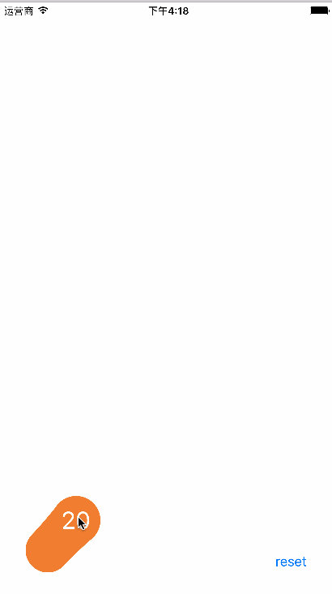

## 仿QQ一键下班效果



## SetUp

``` 
 CASpringView *view = [CASpringView attachToView:self.view withFrame:CGRectMake(30,[UIScreen mainScreen].bounds.size.height - 200, 120, 200)];
    view.count = 20;
    view.stretchRatio = 1 / 20.0 ;
    view.width = 60;
    view.dragRatio = 0.6;
    view.color = [UIColor orangeColor];
    view.boomDistance = 50;
    self.springView = view;
```


